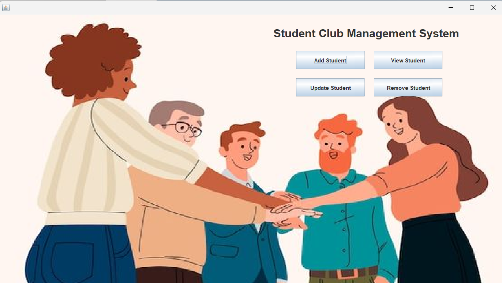
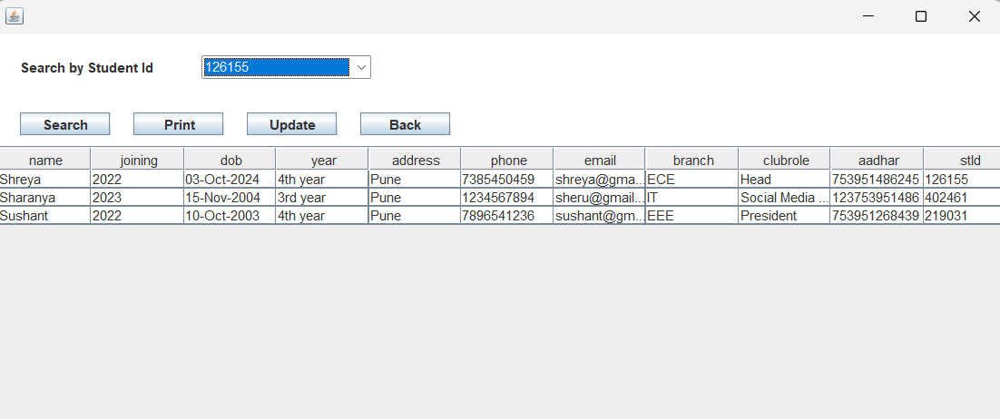

# Student Club Management System

A **Java ** desktop application designed for managing student records efficiently within a student club in a College. This system allows for easy CRUD operations (Create, Read, Update, Delete) and integrates with **MySQL** for database management.

---

## 📋 Features

- **Authorized access:** Only admin login
- **Add Student:** Add new student records.
- **View Students:** Display all student details in a tabular format.
- **Update Student:** Modify details of existing students.
- **Remove Student:** Delete student records.
- **Database Integration:** Uses MySQL for persistent data storage.
- **Print:** Converts table to pdf.

---

## 🛠️ Technologies Used

- **Java** (Swing for GUI)
- **MySQL** (Database)
- **JDBC** (Java Database Connectivity)

---

## Screenshots

### Splash Screen

### Login Screen

### Home Screen

### Add Student Screen

### View Students Screen

### Update Student Screen

### Remove Student Screen

